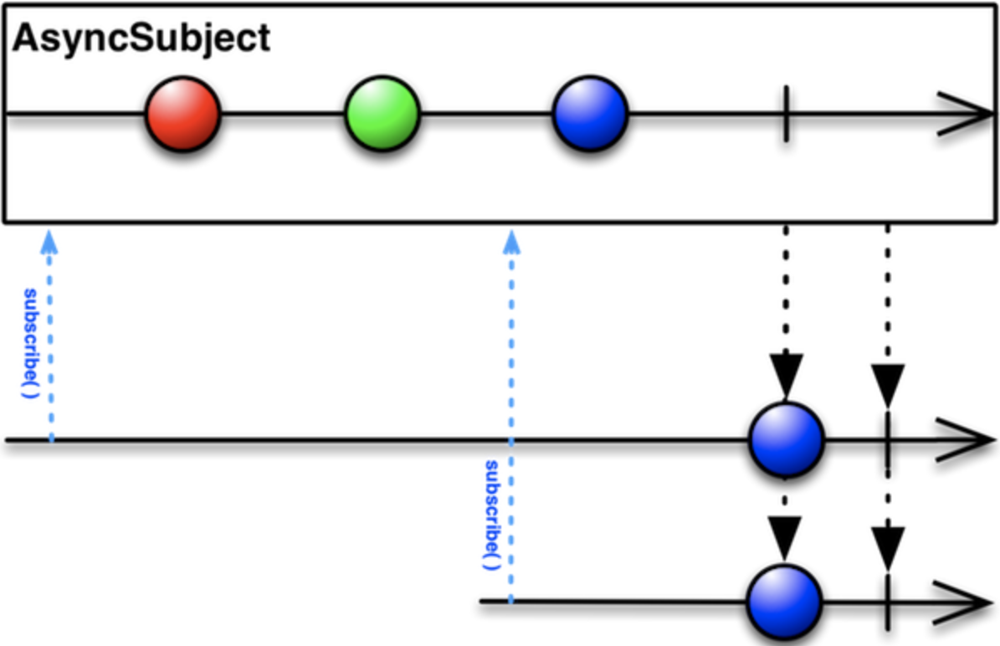
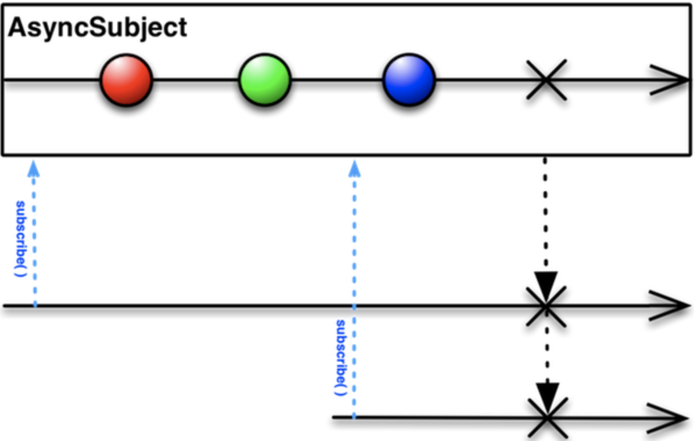
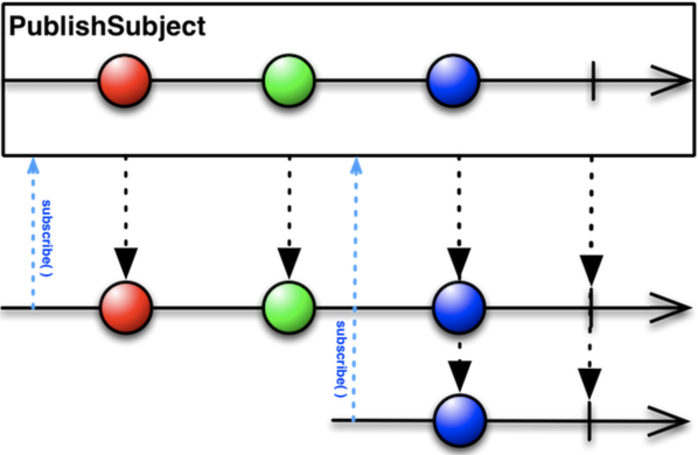
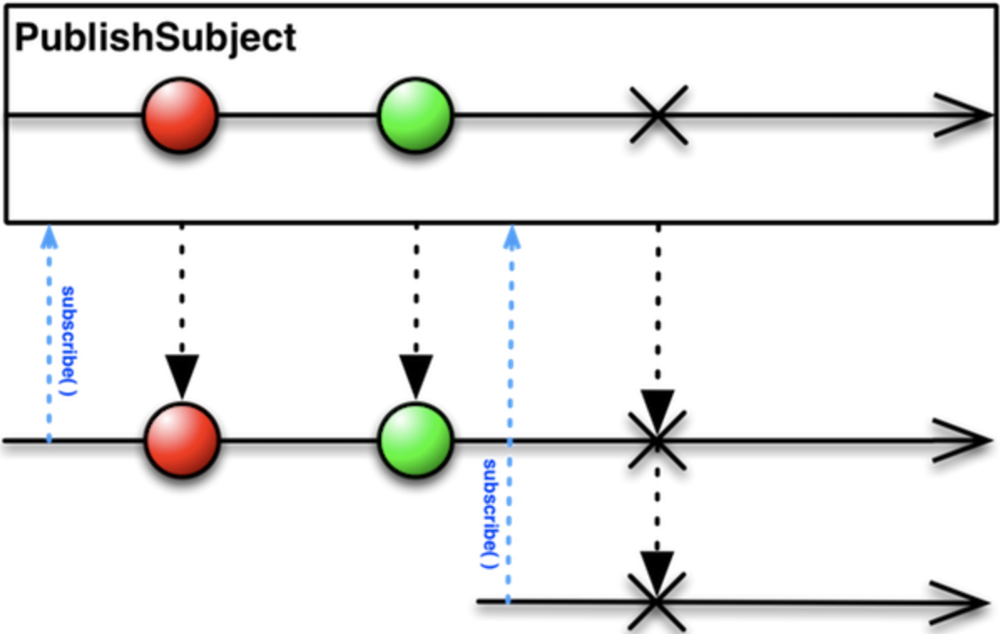
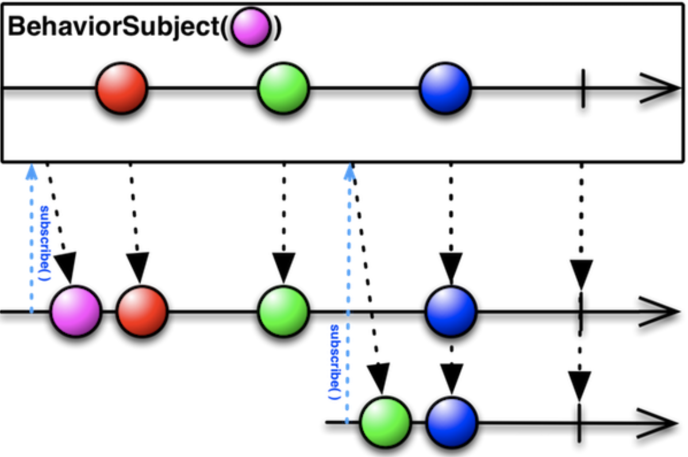
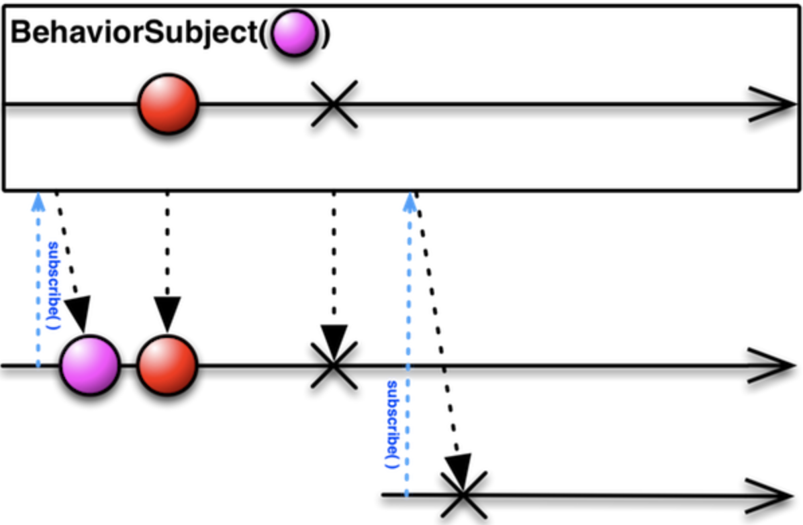

# Subject

### What's a Subject?

Subject in RxSwift is not only an observable but also an observer.  That means we can subscribe it to get the element event and use it to observe other observables events.

```swift
let subject = PublishSubject<Int>.init()
let source = Observable<Int>.just(1)

//In here, subject is an observer which observes the event of "source"
source.bind(to: subject)

//In here, subject becomes an observable emitting events.
let subscription = subject.subscribe {
    event in print(event)
}

--Result--
//.Next(1)
//.Completed
```

### AsyncSubject

`AsyncSubject` is a subject which emits **the last element** before the stream is completed. If the stream has no `Next(Element)` event, then it will only emit `Completed` event.



More, If error occurs, AsyncSubject **won't emit any** **`Next(Element)`event** but only the `Error`.





```swift
let bag = DisposeBag()
let subject = AsyncSubject<Int>()
subject
    .subcribe { event in print(event) }
    .disposed(by: bag)
    
subject.onNext(0)
subject.onNext(1)
subject.onCompleted()

--Output--
next(1)
completed
```



### PublishSubject

`PublishSubject` is a subject which will send **events after the observer subscribed**.



If the stream is terminated for `error` event, it will only emit the `error`.





```swift
let bag = DisposeBag()
let subject = PublishSubject<Int>()
subject
    .subcribe { event in print("first subscription: \(event)") }
    .disposed(by: bag)
    
subject.onNext(0)
subject.onNext(1)

subject
    .subscribe { event in print("second subscription: \(event)") }
    .disposed(by: bag)
    
subject.onNext(2)

--Output--
//first subscription: Next(0)
//first subscription: Next(1)
//first subscription: Next(2)
//second subscription: Next(2)
```



### BehaviorSubject

`BehaviorSubject` is like `PublishSubject` but it will send the latest result as soon as the observer subscribes.







```swift

let bag = DisposeBag()
let subject = BehaviorSubject<Int>(value: -1)
subject
    .subscribe { event in print("first subscription: \(event)") )
    .disposed(by: bag)

subject.onNext(0)
subject.onNext(1)

subject
    .subscribe { event in print("second subscription: \(event)") }
    .disposed(by: bag)
    
subject.onNext(2)

--Output--
//first subscription: Next(-1) //This event is emitted on subscription
//first subscription: Next(0)
//first subscription: Next(1)
//second subscription: Next(1) //This event is emitted on subscription
//first subscription: Next(2)
//second subscription: Next(2)
```



### Variable\(Planned to Deprecated\)

`Variable` is like `var` in Rx,  it takes a default value when init, then we can update it's value by calling `variable.value = <element>`.

Whenever a variable receives a new element, it will emit a `next(Element)` event. A variable will never emit `error` or `completed` event. If we try to send an `error` to a `Variable`, it will crash the system. \(Usually it happens when bind the `Variable` with an observable stream sending `error` event\)

Just like `BehaviorSubject` , `Variable` will emit the event with latest value when observer subscribes it.



```swift
let bag = DisposeBag()
let variable = Variable<Int>.init(0)

//When treat variable as an Observable, we need to call asObservable() on it.
let observable = variable.asObservable() 
observable
    .subscribe { event in print(event) }
    .disposed(by: bag)

variable.value = 1
vairable.value = 2
--Output--
//Next(0) //This event is emitted on subscription
//Next(1)
//Next(2)
```



```swift
let bag = DisposeBag()
let variable = Variable<Int>.init(0)
let source = Observable<Int>.of(1,2,3)
//When treat variable as an Observable, we need to call asObservable() on it.
let observable = variable.asObservable() 
observable
    .subscribe { event in print(event) }
    .disposed(by: bag)
//By calling bind(to: Variable<Int>), the event of source will bind to the variable.    
source.bind(to: variable)
--Output--
//Next(0) //This event is emitted on subscription
//Next(1)
//Next(2)
//Next(3)
```



#### Deprecation

Even though `Variable` has been my beloved wrapper of `BehaviorSubject` , it's planned to be deprecated at the time of writing this page.

The reason of deprecation can be found at [Krunoslav Zaher's post](https://github.com/ReactiveX/RxSwift/issues/1501#issuecomment-347021795). Let's focus on the alternative way: **BehaviorRelay.**

Note: The "Relay" section is at the bottom of this page.



```swift
let variable = Variable<Int>.init(0)
variable.value = 1
```



```swift
let relay = BehaviorRelay<Int>.init(value: 0)
relay.accept(1)
```



So basically everything is pretty the same, we just need to replace `Variable` with `BehaviorRelay`, and value setter with `.accept(Element)`.

### ControlProperty

`ControlProperty` represents property of UI element. \(like `text` in `UITextField`\)  It's properties are:

#### Programatic value changes won't be reported:

Then value update event will only be emitted when it's value is updated from UI interaction.

#### It never fails.

As it is a property of UI Element, there's should never be any `error` event.

#### shareReplay\(1\)

Which means the subscription will be shared in multiple observers, and it will emit the latest value when subscribed.

Please go to the operator section for more detail information.



#### It will \`Complete\` sequence on control being deallocated.

`ControlProperty` will send `completed` event when it is deallocated.

#### It delivers events on \`MainScheduler.instance\`.

All the events will be emitted on the main thread.

#### Refs:

All the images in this page are from [here](https://beeth0ven.github.io/RxSwift-Chinese-Documentation/), which is also a nice RxSwift Gitbook.

## Relay

`*Relay` classes were introduced with RxSwift 4. Besides that **It can't terminate with an `error` on a `completed` event,**  every thing works pretty the same way as `*Subject` does. It's just a simple wrapper of `*Subject`. Let's look at the implementation of `BehaviorRelay` :

```swift
/// BehaviorRelay is a wrapper for `BehaviorSubject`.
///
/// Unlike `BehaviorSubject` it can't terminate with error or completed.
public final class BehaviorRelay<Element>: ObservableType {
    public typealias E = Element
    private let _subject: BehaviorSubject<Element>
    // Accepts `event` and emits it to subscribers
    public func accept(_ event: Element) {
        _subject.onNext(event)
    }
    /// Current value of behavior subject
    public var value: Element {
        // this try! is ok because subject can't error out or be disposed
        return try! _subject.value()
    }
    /// Initializes variable with initial value.
    public init(value: Element) {
        _subject = BehaviorSubject(value: value)
    }
    /// Subscribes observer
    public func subscribe<O: ObserverType>(_ observer: O) -> Disposable where O.E == E {
        return _subject.subscribe(observer)
    }
    /// - returns: Canonical interface for push style sequence
    public func asObservable() -> Observable<Element> {
        return _subject.asObservable()
    }
}
```

So we can see that the function `accept(_ event: Element)` is just a wrapper of `onNext(Element)` in the `*Subject`.  As there's only possible to send next event, it won't error out or complete.

